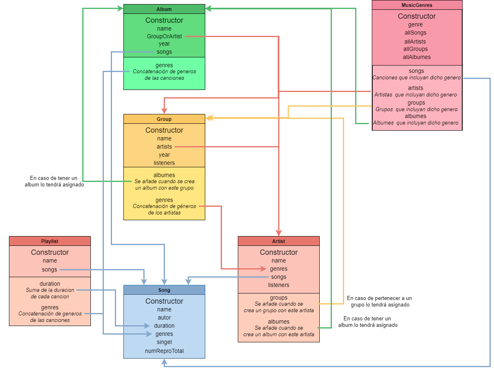

# Práctica 7 - Digitalizando la colección de música de los abuelos

---

## Autores:

Vlatko Jesús Marchán Sekulic | alu0101321141@ull.edu.es

Yeixon Morales Gonzalez      | alu0101133324@ull.edu.es

Nicolas Vegas Rodriguez      | alu0101321745@ull.edu.es

Luciano Sekulic Gregoris     | alu0101022239@ull.edu.es

---

## 1. Introduccción de la práctica.


## 2. Jerarquía de clases planteada.

Con lo que respecta a la jerarquía de clases se ha decido implementar el siguiente esquema:



Tal y como se puede observar nuestro proyecto consta de 5 niveles de jerarquía de clases en las que se: 

En la jerarquía de clases la que se encuentra en la posición más baja es la clase __Song__ ya que esta no depende de ninguna otra, Esta clase se encargará de almacenar los principales elementos para definir una canción. 

La siguiente en jerarquía sería la clase __PlayList__ ya que dicha clase se encarga de guardar una lista de canciones deseadas por el usuario. Esta clase depende única y exclusivamente de la clase __Song__ ya que esta guarda un vector de canciones.

Seguidamente nos encontramos con la clase __Artist__ dicha clase define un artista teniendo como datos principales, Los géneros musicales a los que se dedica dicho artista, las canciones que interpreta, los oyentes que tiene mensualmente y por otro lado los grupos a los que pertenece y álbumes publicados. 


Continuando con la jerarquía tenemos la clase __Group__ que se encarga de asignarle a cada artista el grupo al que pertenece, esta guardará toda información básica del grupo.

En el siguiente nivel encontramos la clase __Albums__ que se encarga de guardar las canciones de un álbum del artista o grupo que lo haya publicado

En el último nivel encontramos la clase __MusicGenre__ esta clase se encarga de almacenar todas las canciones, artistas, grupos y álbumes relacionados con un género musical 

## 3. Desglose de la implementación de las clases.
---
1. __Clase Song__

Clase creada para representar canciones para las playlist de la biblioteca de música. Constructor 

Al constructor se le pasan las siguientes variables:

* un nombre de la canción de tipo string
* El autor de la canción de tipo string
* La duración de la canción de tipo number
* Un vector de géneros de un tipo de dato creado llamado genres
* Un booleano para comprobar si es un single o en grupo
* Un número de reproducciones totales de la canción de tipo number

```typescript

```

Getters y setters.

Se han creado los getters y setters necesarios para el correcto funcionamiento de la clase Song para ser utilizados en el resto del código.

---

2. __clase Playlist__

Clase creada para representar las playlist de la biblioteca de música. 

Al constructor se le pasan Constructor

En primer lugar se crean las siguientes variables privates igualadas a cero y a vacío:
* Duration de tipo number
* Vector de genres de tipo genre
	
Por otro lado, al constructor se le pasa una variable nombre de tipo string y un vector de canciones de tipo song. Dentro del mismo se utiliza __refreshData__ que es un Método el cual se encarga de calcular los géneros y la duración de la playlist.  se le pasan las siguientes variables

```typescript

```

Getters y setters

Se han creado los getters y setters necesarios para el correcto funcionamiento de la clase Playlist para ser utilizados en el resto del código.

Métodos

* __Función refreshData:__ Esta función realiza la suma de la duración de cada canción y un push al vector de los géneros.
```typescript

```
* __Función addSong:__ Esta función añade una canción a la playlist.
```typescript

```
* __Función removeSong:__ Esta función elimina una canción en el caso de que exista.
```typescript

```

---

3. __clase Artist__

Clase creada para representar a los artistas en la biblioteca musical Constructor En primer lugar se crean las siguientes variables privates igualadas a vacío:

* Vector de grupos de tipo Group
* Vector de álbumes de tipo Album

Por otro lado, al constructor se le pasa una variable nombre de tipo string, un vector 	de genres de tipo genre, un vector de canciones de tipo song y una variable listeners de tipo number que son la cantidad de oyentes mensuales.  

```typescript 

```

Getters y setters

Se han creado los getters y setters necesarios para el correcto funcionamiento de la clase Artist para ser utilizados en el resto del código.
Métodos 
* __Función addGroup__ Esta función añade un grupo mediante un push..
```typescript 

```

* __Función removeGroup:__ Esta función elimina un grupo en el caso de que exista.
```typescript 

```

* __Función addAlbum:__ Esta función añade un álbum mediante un push..
```typescript 

```

* __Función removeAlbum:__ Esta función elimina un álbum en el caso de que exista.
```typescript 

```

---

4. __clase Group__

Clase creada para representar a los grupos de autores en la biblioteca musical.

Constructor

En primer lugar se crean las siguientes variables privates igualadas a vacío:

* Vector de álbumes de tipo Album
* Vector de géneros de tipo Genre

Por otro lado, se le pasa un nombre de tipo string, un vector de artistas de tipo artist, el año de creación del grupo de tipo Date y una variable llamada listeners de tipo number que son la cantidad de oyentes mensuales.

```typescript 

```

Dentro del mismo se recorre mediante un forEach los artistas, se añaden los grupos y luego se vuelve a hacer un forEach para incluir el género de la canción en el vector en caso de que no se haya puesto anteriormente.

Getters y setters.

Se han creado los getters y setters necesarios para el correcto funcionamiento de la clase Group para ser utilizados en el resto del código. Se destaca el setArtist donde se recorren los artistas, se elimina el grupo y luego se vuelven a recorrer el vector de artistas “modificados” con los nuevos artistas para añadir los grupos.

```typescript 

```

Métodos

* __Función addAlbum:__ Esta función añade un álbum mediante un push.
```typescript

```
* __Función removeAlbum:__ Esta función elimina un álbum en el caso de que exista.

```typescript 

``` 

---

5. __Clase Álbum__

Clase creada para representar los álbumes de la biblioteca de música. 

Constructor.

En primer lugar se crea un vector genre de tipo genre igualada a vacío. Por otro lado, al constructor se le pasa una variable nombre de tipo string, una variable llamada GroupOrArtist que puede ser del tipo group o artist que consiste en el nombre del grupo o artista;year de tipo Date y un vector de canciones de tipo song. Dentro del mismo se utiliza __refreshData__ que es un Método el cual se encarga de recalcular los géneros que incluye el álbum y se añade al álbum el contenido de la variable GroupOrArtist.

```typescript

```

Getters y setters

Se han creado los getters y setters necesarios para el correcto funcionamiento de la clase Álbum para ser utilizados en el resto del código. Se destaca setGroupAndArtist donde se actualiza nombre del grupo o artista y setSongs el cual actualiza todas las canciones del álbum.  

Métodos

* __Función refreshData:__ Esta función calcula de nuevo los géneros que se incluyen en el álbum.
```typescript

```

* __Función addSong:__ Esta función añade una canción a la playlist.
```typescript

```

---

6. __Clase musicGenre__

Clase creada para representar los géneros musicales en la biblioteca musical. Luego, se crea un type genres donde están los tipos de género musical que se tendrá. 

Constructor

Se crean varios vectores vacíos para los artistas, grupos, álbumes y canciones de su respectivo tipo de dato. Después al constructor se le pasan una variable genre de tipo genre y todos los vectores inicializados anteriormente. Dentro del mismo, se recorren estos vectores de manera independiente y se comprueba si el género es el mismo y si está incluido dentro del vector, si es así se hace el push correspondiente al vector de cada tipo de dato.

```typescript

```

Getters y setters

Se han creado los getters y setters necesarios para el correcto funcionamiento de la clase musicGenre para ser utilizados en el resto del código. Se destacan setGenre donde se actualiza el género y los demás se realiza lo mismo que en el constructor.
