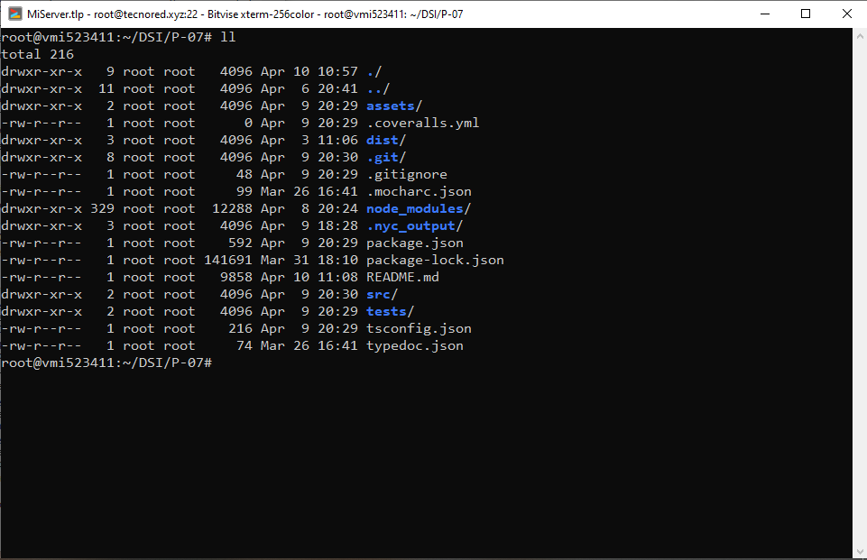
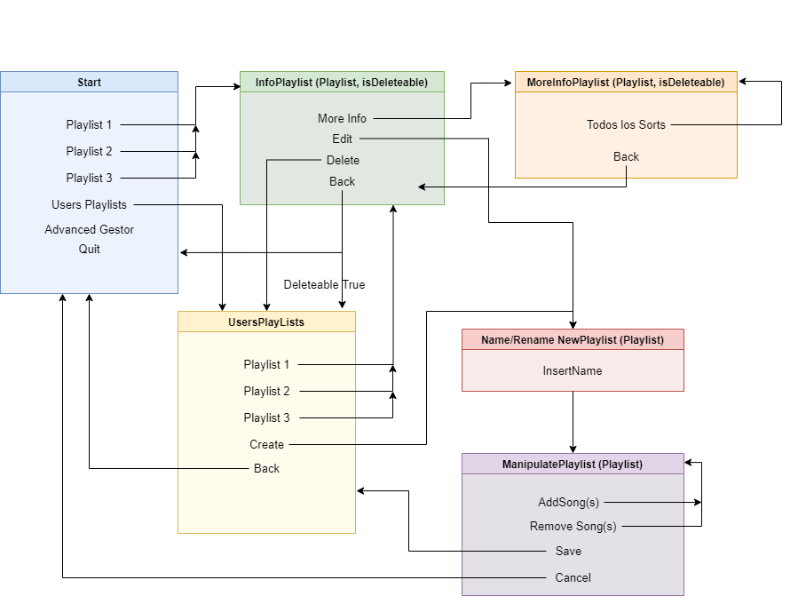
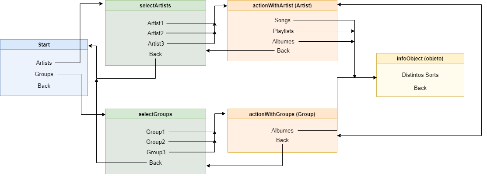

# Práctica 7 - Digitalizando la colección de música de los abuelos

[](https://github.com/ULL-ESIT-INF-DSI-2122/ull-esit-inf-dsi-21-22-prct07-music-datamodel-grupo-d/actions/workflows/tests.yml)
[](https://coveralls.io/github/ULL-ESIT-INF-DSI-2122/ull-esit-inf-dsi-21-22-prct07-music-datamodel-grupo-d?branch=main)
[](https://sonarcloud.io/summary/new_code?id=ULL-ESIT-INF-DSI-2122_ull-esit-inf-dsi-21-22-prct07-music-datamodel-grupo-d)
[](https://sonarcloud.io/summary/new_code?id=ULL-ESIT-INF-DSI-2122_ull-esit-inf-dsi-21-22-prct07-music-datamodel-grupo-d)
[](https://sonarcloud.io/summary/new_code?id=ULL-ESIT-INF-DSI-2122_ull-esit-inf-dsi-21-22-prct07-music-datamodel-grupo-d)


---

## Autores:

Vlatko Jesús Marchán Sekulic | alu0101321141@ull.edu.es

Yeixon Morales Gonzalez      | alu0101133324@ull.edu.es

Nicolas Vegas Rodriguez      | alu0101321745@ull.edu.es

Luciano Sekulic Gregoris     | alu0101022239@ull.edu.es

---

## 1. Introduccción de la práctica.

En la práctica se pide digitalizar la colección de música de nuestros abuelos, para ello se ha realizado una serie de Clases para la correcta integración de todos los datos de dicha colección.

### 1.1 Organización del grupo

Para el desarrollo de la práctica todos los integrantes del grupo se han encargado de diferentes tareas para la creación del programa, para ello nos hemos repartido de manera equitativa la documentación y código de las clases.

### 1.2 Método de desarollo.

Todos los integrantes del grupo nos hemos conectado mediante el uso de ssh a un servidor del compañero Yeixon Morales, por este motivo la mayoría de commits del desarrollo son realizados desde su cuenta github.



## 2. Jerarquía de clases planteada.

Con lo que respecta a la jerarquía de clases se ha decido implementar el siguiente esquema:


Tal y como se puede observar nuestro proyecto consta de 5 niveles de jerarquía de clases en las que se: 

En la jerarquía de clases la que se encuentra en la posición más baja es la clase __Song__ ya que esta no depende de ninguna otra, Esta clase se encargará de almacenar los principales elementos para definir una canción. 

La siguiente en jerarquía sería la clase __PlayList__ ya que dicha clase se encarga de guardar una lista de canciones deseadas por el usuario. Esta clase depende única y exclusivamente de la clase __Song__ ya que esta guarda un vector de canciones.

Seguidamente nos encontramos con la clase __Artist__ dicha clase define un artista teniendo como datos principales, Los géneros musicales a los que se dedica dicho artista, las canciones que interpreta, los oyentes que tiene mensualmente y por otro lado los grupos a los que pertenece y álbumes publicados. 


Continuando con la jerarquía tenemos la clase __Group__ que se encarga de asignarle a cada artista el grupo al que pertenece, esta guardará toda información básica del grupo.

En el siguiente nivel encontramos la clase __Albums__ que se encarga de guardar las canciones de un álbum del artista o grupo que lo haya publicado

En el último nivel encontramos la clase __MusicGenre__ esta clase se encarga de almacenar todas las canciones, artistas, grupos y álbumes relacionados con un género musical 

## 3. Desglose de la implementación de las clases.
---
1. __Clase Song__

Clase creada para representar canciones para las playlist de la biblioteca de música. Constructor 

Al constructor se le pasan las siguientes variables:

* Un nombre de la canción de tipo string
* El autor de la canción de tipo string
* La duración de la canción de tipo number
* Un vector de géneros de un tipo de dato creado llamado genres
* Un booleano para comprobar si es un single o en grupo
* Un número de reproducciones totales de la canción de tipo number

```typescript
constructor(
private name: string, private autor: string, private duration: number, private genres: Genres[], private single: boolean, private numReproTotal: number) {}
```

Getters y setters.

Se han creado los getters y setters necesarios para el correcto funcionamiento de la clase Song para ser utilizados en el resto del código.

---

2. __clase Playlist__

Clase creada para representar las playlist de la biblioteca de música. 

Al constructor se le pasan:

En primer lugar se crean las siguientes variables privates igualadas a cero y a vacío:
* Duration de tipo number
* Vector de genres de tipo genre
	
Por otro lado, al constructor se le pasa una variable nombre de tipo string y un vector de canciones de tipo song. Dentro del mismo se utiliza __refreshData__ que es un Método el cual se encarga de calcular los géneros y la duración de la playlist.  se le pasan las siguientes variables

```typescript
constructor(private name: string, private songs: Song[]) {
  this.refreshData();
}
```

Getters y setters

Se han creado los getters y setters necesarios para el correcto funcionamiento de la clase Playlist para ser utilizados en el resto del código.

Métodos

* __Función refreshData:__ Esta función realiza la suma de la duración de cada canción y un push al vector de los géneros.
```typescript
private refreshData(){
  this.duration = 0;
  this.genres = [];
  this.songs.forEach((song: Song) => {
    this.duration += song.getDuration();
    song.getGenres().forEach((genre: Genres) => {
      if (!this.genres.includes(genre)) {
        this.genres.push(genre);
      }
    });
  });
}
```
* __Función addSong:__ Esta función añade una canción a la playlist.
```typescript
addSong(newSong: Song) {
  this.songs.push(newSong);
  this.refreshData();
  }
```
* __Función removeSong:__ Esta función elimina una canción en el caso de que exista.
```typescript
 removeSong(removeSong: Song) {
    const posSong = this.songs.indexOf(removeSong);
    if (posSong > -1) this.songs.splice(posSong, 1);
    this.refreshData();
  }
```

---

3. __clase Artist__

Clase creada para representar a los artistas en la biblioteca musical.

Constructor

En primer lugar se crean las siguientes variables privates igualadas a vacío:

* Vector de grupos de tipo Group
* Vector de álbumes de tipo Album

Por otro lado, al constructor se le pasa una variable nombre de tipo string, un vector de canciones de tipo song, un vector de y una variable listeners de tipo number que son la cantidad de oyentes mensuales.  

```typescript 
constructor(private name: string, private songs: Song[], private listeners: number){
  this.refereshData();
  }
```

Getters y setters

Se han creado los getters y setters necesarios para el correcto funcionamiento de la clase Artist para ser utilizados en el resto del código.

Métodos 

* __Función addGroup__ Esta función añade un grupo mediante un push..
```typescript 
addGroup(newGroup: Group) {
  this.groups.push(newGroup);
  }
```

* __Función removeGroup:__ Esta función elimina un grupo en el caso de que exista.
```typescript 
removeGroup(delGroup: Group) {
  const posGroup = this.groups.indexOf(delGroup);
  if (posGroup > -1) this.groups.splice(posGroup, 1);
  }
```

* __Función addAlbum:__ Esta función añade un álbum mediante un push..
```typescript 
addAlbum(newAlbum: Album) {
  this.albumes.push(newAlbum);
  }
```

* __Función removeAlbum:__ Esta función elimina un álbum en el caso de que exista.
```typescript 
removeAlbum(delAlbum: Album) {
    const posAlbum = this.albumes.indexOf(delAlbum);
    if (posAlbum > -1) this.albumes.splice(posAlbum, 1);
  }
```

---

4. __clase Group__

Clase creada para representar a los grupos de autores en la biblioteca musical.

Constructor

En primer lugar se crean las siguientes variables privates igualadas a vacío:

* Vector de álbumes de tipo Album
* Vector de géneros de tipo Genre

Por otro lado, se le pasa un nombre de tipo string, un vector de artistas de tipo artist, el año de creación del grupo de tipo Date y una variable llamada listeners de tipo number que son la cantidad de oyentes mensuales.

> Cabe recalcar que cuando se crea un grupo, los artistas dentro del mismo, se actualizan, añadiendosele este grupo a dichos artistas

```typescript 
constructor(private name: string, private artists: Artist [], private creationYear: Date, private listeners: number) {
  artists.forEach((artist: Artist) => {
    artist.addGroup(this);
    artist.getGenres().forEach((genre: Genres) => {
      if (!this.genres.includes(genre)) {
        this.genres.push(genre);
      }
    });
  });
}
```

Dentro del mismo se recorre mediante un forEach los artistas, se añaden los grupos y luego se vuelve a hacer un forEach para incluir el género de la canción en el vector en caso de que no se haya puesto anteriormente.

Getters y setters.

Se han creado los getters y setters necesarios para el correcto funcionamiento de la clase Group para ser utilizados en el resto del código. Se destaca el setArtist donde se recorren los artistas, se elimina el grupo y luego se vuelven a recorrer el vector de artistas “modificados” con los nuevos artistas para añadir los grupos.

```typescript 
setArtist(newArtist:Artist[]) {
  this.artists.forEach((artist: Artist) => {
    artist.removeGroup(this);
  });
  this.artists = newArtist;
  this.artists.forEach((artist: Artist) => {
    artist.addGroup(this);
  });
}
```

Métodos

* __Función addAlbum:__ Esta función añade un álbum mediante un push.
```typescript
addAlbum(newAlbum: Album) {
  this.albumes.push(newAlbum);
}
```
* __Función removeAlbum:__ Esta función elimina un álbum en el caso de que exista.

```typescript 
removeAlbum(delAlbum: Album) {
  const posAlbum = this.albumes.indexOf(delAlbum);
  if (posAlbum > -1) this.albumes.splice(posAlbum, 1);
}
``` 

---

5. __Clase Álbum__

Clase creada para representar los álbumes de la biblioteca de música. 

Constructor.

En primer lugar se crea un vector genre de tipo genre igualada a vacío. Por otro lado, al constructor se le pasa una variable nombre de tipo string, una variable llamada GroupOrArtist que puede ser del tipo group o artist que consiste en el nombre del grupo o artista;year de tipo Date y un vector de canciones de tipo song. Dentro del mismo se utiliza __refreshData__ que es un Método el cual se encarga de recalcular los géneros que incluye el álbum y se añade al álbum el contenido de la variable GroupOrArtist.

> Cabe recalcar que cuando se crea un album, el artista o grupo dentro del mismo, se actualizan, añadiendosele este album a dicho artista o grupo

```typescript
constructor(private name: string, private GroupOrArtist: Group | Artist, private year: Date, private songs: Song []) {
  GroupOrArtist.addAlbum(this);

  this.refreshData();
}
```

Getters y setters

Se han creado los getters y setters necesarios para el correcto funcionamiento de la clase Álbum para ser utilizados en el resto del código. Se destaca setGroupAndArtist donde se actualiza nombre del grupo o artista y setSongs el cual actualiza todas las canciones del álbum.  

```typescript
setGroupAndArtist(newGroupOrArtist: Group | Artist) {
  this.GroupOrArtist.removeAlbum(this);
  this.GroupOrArtist = newGroupOrArtist;
  this.GroupOrArtist.addAlbum(this);
}
```

Métodos

* __Función refreshData:__ Esta función calcula de nuevo los géneros que se incluyen en el álbum.
```typescript
private refreshData(){
  this.genres = [];
  this.songs.forEach((song: Song) => {
    song.getGenres().forEach((genre: Genres) => {
      if (!this.genres.includes(genre)) {
        this.genres.push(genre);
      }
    });
  });
}
```

* __Función addSong:__ Esta función añade una canción a la playlist.
```typescript
addSong(newSong: Song) {
  this.songs.push(newSong);
  this.refreshData();
}
```

---

6. __Clase musicGenre__

Clase creada para representar los géneros musicales en la biblioteca musical. Luego, se crea un type de genres donde están los tipos de género musical que se tendrá. 

Constructor

Se crean varios vectores vacíos para los artistas, grupos, álbumes y canciones de su respectivo tipo de dato. Después al constructor se le pasan una variable genre de tipo genre y todos los vectores inicializados anteriormente. Dentro del mismo, solo se actualizan los artistas, los grupos, los albumes y las canciones.

```typescript
constructor(private genre: Genres, allSongs: Song[], allArtists: Artist[], allGroups: Group[], allAlbumes: Album[]) {
  this.setArtists(allArtists);
  this.setGroups(allGroups);
  this.setAlbumes(allAlbumes);
  this.setSongs(allSongs);
  }
```

Getters y setters

Se han creado los getters y setters necesarios para el correcto funcionamiento de la clase musicGenre para ser utilizados en el resto del código. Se destacan setGenre donde se actualiza el género musical y los demas set, los cuales en cada uno independiente se inicializa artist, group, song y album, se recorre con un forEach y luego dentro se recorre los generos para ver si ya esta el genero, si no es asi se actualiza haciendo un push al vector correspondiente creados antes del constructor.

```typescript
setGenre(newGenre: Genres) {
  this.myAlbumes = [];
  this.myArtists = [];
  this.myGroups = [];
  this.mySongs = [];
  this.genre = newGenre;
}

setArtists(newArtists: Artist[]) {
  this.myArtists = [];
  newArtists.forEach((artist: Artist) => {
    artist.getGenres().forEach((genre_: Genres) => {
      if (genre_ === this.genre && !this.myArtists.includes(artist)) {
        this.myArtists.push(artist);
      }
    });
  });
}
```
---

## 4. LowDB.

El módulo LowDB es la base para la implementación de las clases gestoras, ya que este se encarga de convertir en persistente la información. 

Todas las funciones de guardado y cargado en la base de datos siguen la misma lógica por lo que se explicará unicamente la implementación de la relacionada con las __playlist__. 

* __savePlaylistsOnDB__: recibe un vector de playlist el cual se guardará, para ello lo que hacemos es recorrer dicho vector y llamar a otro método que se encarga de guardar una playlist (addPlaylistToDB).

* __addPlaylistToDB__: La función se encarga de guardar una playlist. para ello se comprueba si en el fichero existe el vector de las playlist, en caso contrario se crea. Posteriormente, se obtiene dicho vector y se comprueba si la playlist no se encuentra ya cargada, en caso de no estar se añade. Para añadirla, se añade el nombre de la playlist y un vector de canciones vacio. Este vector de canciones se rellena posteriormente buscando dentro del vector de playlist aquella que coincida con la guradada anteriormente y obteniendo así el vector de canciones para ser rellenado con el nombre de la canción.

> Cabe remarcar que la clave primaria de toda la base de datos es el nombre de los objetos.


* __loadPlaylistFromDB__: recibe un vector con todas las canciones, el cual se usa para vincular los nombres guardados de las canciones con el objeto real. Para comenzar comprobamos que existe el vector de playlist en nuestro fichero, en caso afirmativo lo obtenemos. Debido a que en typescript es necesario conocer el tipo del dato se creo un type que representaría dicha información guardada. Una vez hemos cargado el vector de playlist recorremos cada playlist y construimos dichas playlist para ser retornadas.

Métodos

* __savePlaylistsOnDB__
```Typescript
export function savePlaylistsOnDB(playlists: Playlist[]): void {
  // Añade todo el vector de playlists
  playlists.forEach((playlist: Playlist) => {
    addPlaylistToDB(playlist);
  });
}
```

* __addPlaylistToDB__
```Typescript
export function addPlaylistToDB(playlist: Playlist): void {
  // Inicializa el fichero
  db.defaults({Playlists: []})
      .write();

  // Evita que se guarden datos duplicados
  db.get('Playlists')
      .remove({name: playlist.getName()})
      .write();

  // Añade la playlist
  db.get('Playlists')
      .push({
        name: playlist.getName(),
        songs: [],
      })
      .write();

  playlist.getSongs().forEach((song: Song) => {
    db.get('Playlists')
        .find({name: playlist.getName()})
        .get('songs')
        .push(song.getName())
        .write();
  });
}
```

* __loadPlaylistFromDB__

```Typescript
export type PlaylistJSON = {
  name: string,
  songs: string[]
}

export function loadPlaylistsFromDB(allSongs: Song[]): Playlist[] {
  // Inicializa el fichero
  db.defaults({Playlists: []})
    .write();

  // Cargo los datos del fichero
  const playlistsJSON: PlaylistJSON[] = db.get('Playlists').write();

  const playlistsResult: Playlist[] = [];

  playlistsJSON.forEach((playlist: PlaylistJSON) => {
    // Populate Songs
    const songs: Song[] = [];
    playlist.songs.forEach((songInPlaylist: string) => {
      allSongs.forEach((song: Song) => {
        if (songInPlaylist === song.getName()) {
          songs.push(song);
          return 0;
        }
      });
    });

    playlistsResult.push(new Playlist(playlist.name, songs));
  });

  return playlistsResult;
}
```

---

## 5. Clase gestor, advancedGestor y la implementación del Inquirer

Para el desarollo de la clase gestor y gestor avanzado es necesario utilizar el módulo inquirer el cual nos permite generar una interfaz mediante la cual nuestro usuario pueda interacturar de manera correcta con nuestro programa. Para ello fue necesario crear dos clases gestoras las cuales se encargan de tomar información y gestionarla.


1. __Clase gestor__

La implementación utilizada para el uso del inquire en la clase gestor sigue el siguiente esquema:



La clase gestor pasará por distintos estados tal y como se representa en la imagen de arriba:

* __start__: Deja seleccionar las playlist pre guardadas en la base de datos, además de ir al apartado de la play list de los usuarios. Por otro lado, deja ir a la clase Advanced Gestor y por ultimo nos deja salir de la ejecución.

* __InfoPlaylist__: Es un método que recibe dos atributos. La playlist de la que queremos operar y un booleano que nos indica si la playlist es del usuario o es una por defecto. Además tendremos diferentes acciones a realizar:
  
  * __More info__: Nos permite llamar a otro método que mostrará más detalles sobre la playlist

  * __Edit__: Permitirá que dicha playlist pueda ser editada por el usuario

  * __Delete__: Permite borrar una playlist solo en caso si dicha playlist pertenece al usuario.

  * __Back__: Volvemos al estado anterior.

* __More infoPlaylist__: Recibe una playlist y si dicha playlist pertenece al usuario. Muestra todas las canciones dentro de dicha playlist. 
  
  * __Todos los Sorts__: Métodos de ordenación de canciones pedidos en la práctica. 

  * __Back__: Volvemos al estado anterior.

* __User Playlist__: Tenemos las diferentes playlist creadas por el usuario. además le damos la opción de crear una playlist desde cero y la posibilidad de volver atrás.
 
* __NameOrRename__: Recibe una playlist a la cual se le va a poner el nombre que el usuario digite por consola de esta manera creando así una nueva playlist de usuario.

* __ManipulatePlaylist__: Recibe una playlist en la cual poderemos realizar diferentes acciones, como:
  
  * __addSong(s)__: Nos añade una cancion o varias canciones.

  * __removeSong(s)__: Nos permite eliminar una o varias canciones de la playlist. (En caso de no tener canciones la playlist esta opción no está disponible)

  * __save__: Nos permite guardar las modificaciones para que sean persistentes. 

  * __cancel__: No guarda las acciones realizadas.

Constructor. 

Se crean vectores vacíos para las canciones, las paylist y los usuarios de la playlist de sus respectivos tipos de datos. Además, se crea una nueva instancia del tipo AdvanceGestor. Luego, se cargan las canciones, las playlist y los usuarios de la playlist mediante unas funciones creadas con lowdb que posteriormente se explicarán más en profundidad. 

```typescript
constructor() {
  this.songs = loadSongsFromDB();
  this.playlists = loadPlaylistsFromDB(this.songs);
  this.usersPlaylists = loadUsersPlaylistsFromDB(this.songs);
  }
``` 

Métodos

* __Start:__
```typescript
start() {
  // Tipo de dato para creaar las opciones
  type viewPlaylistJSON = {
    name: string,
    value: number
  }
  // Vectores de opciones
  const options: viewPlaylistJSON[] = [];
  this.playlists.forEach((playlist: Playlist, index: number) => {
    options.push(this.showPlaylistRawInfo(playlist, index));
  });

  // Opciones para salir y ver las playlist del usuario
  options.push({name: "User Playlist", value: -1});
  options.push({name: "Advanced Gestor", value: -2});
  options.push({name: "Quit", value: -3});

  // Limpiamos consola
  console.clear();

  inquire.prompt({
    type: 'list',
    pageSize: 12,
    name: 'playlist',
    message: 'Select Playlist for more informations',
    choices: options,
  }).then((res: {playlist: number}) => {
    if (res.playlist >= 0) {
      // Informacion de la Playlist seleccionada
      this.actionsPlaylist(this.playlists[res.playlist], false);
    } else if (res.playlist === -1) {
      this.userPlayList();
    } else if (res.playlist === -2) {
      // Advanced Gestor
      this.advancedGestor.start();
    } else return 0;
  });
}
``` 
* __userPlaylist:__
```typescript
userPlayList() {
  // Tipo de dato para creaar las opciones
  type viewPlaylistJSON = {
    name: string,
    value: number
  }
  // Vectores de opciones
  const options: viewPlaylistJSON[] = [];
  this.usersPlaylists.forEach((playlist: Playlist, index: number) => {
    options.push(this.showPlaylistRawInfo(playlist, index));
  });

  // Opciones para salir y ver las playlist del usuario
  options.push({name: "Create", value: -2});
  options.push({name: "Back", value: -1});

  // Limpiamos consola
  console.clear();

  inquire.prompt({
    type: 'list',
    pageSize: 12,
    name: 'playlist',
    message: 'Select Playlist for more informations',
    choices: options,
  }).then((res: {playlist: number}) => {
    if (res.playlist >= 0) {
      // Informacion de la Playlist seleccionada
      this.actionsPlaylist(this.usersPlaylists[res.playlist], true);
    } else if (res.playlist === -1) {
      this.start();
    } else if (res.playlist === -2) {
      this.newOrRenamePlayList(new Playlist("New Playlist", []), true);
    }
  });
}
``` 

* __actionPlaylist:__
```typescript
actionsPlaylist(playlist: Playlist, isDeleteable: boolean) {
  console.clear();

  inquire.prompt({
    type: 'list',
    pageSize: 12,
    name: 'infoPlaylist',
    message: 'Actions with ' + playlist.getName(),
    choices: isDeleteable ? [
      {name: "More Info", value: 0},
      {name: "Edit", value: 1},
      {name: "Delete", value: 2},
      {name: "Back", value: -1},
    ]:[
      {name: "More Info", value: 0},
      {name: "Edit", value: 1},
      {name: "Back", value: -1},
    ],
  }).then((res: {infoPlaylist: number}) => {
    switch (res.infoPlaylist) {
      case -1:
        isDeleteable ? this.userPlayList() : this.start();
        break;
      case 0:
        this.moreInfoPlaylist(playlist, 0, false, isDeleteable);
        break;
      case 1:
        isDeleteable ? this.manipulatePlaylist(playlist) : this.newOrRenamePlayList(playlist, true);
        break;
      case 2:
        const pos: number = this.usersPlaylists.indexOf(playlist);
        if (pos >= 0) this.usersPlaylists.splice(pos, 1);
        saveUsersPlaylistsOnDB(this.usersPlaylists);
        this.userPlayList();
        break;

      default:
        break;
    }
  });
}
``` 

* __newOrRenamePlaylist:__
```typescript
newOrRenamePlayList(playlist: Playlist, isNew: boolean) {
  inquire.prompt({
    name: 'namePlaylist',
    message: 'New name playlist',
  }).then((res: {namePlaylist: string}) => {
    if (!isNew) {
      playlist.setName(res.namePlaylist);
      saveUsersPlaylistsOnDB(this.usersPlaylists);
      this.manipulatePlaylist(playlist);
    } else {
      const newPlaylist: Playlist = new Playlist(res.namePlaylist, playlist.getSongs());
      this.manipulatePlaylist(newPlaylist);
    }
  });
}
``` 

* __manipulatePlaylist:__
```typescript
manipulatePlaylist(playlist: Playlist) {
  console.clear();

  inquire.prompt({
    type: 'list',
    pageSize: 12,
    name: 'manipulatePlaylist',
    message: 'Actions with ' + playlist.getName(),
    choices: playlist.getSongs().length > 0 ? [
      {name: "Rename", value: 0},
      {name: "Add Song(s)", value: 1},
      {name: "Remove Song(s)", value: 2},
      {name: "Save", value: 3},
      {name: "Cancel", value: -1},
    ]:
    [
      {name: "Rename", value: 0},
      {name: "Add Song(s)", value: 1},
      {name: "Save", value: 3},
      {name: "Cancel", value: -1},
    ],
  }).then((res: {manipulatePlaylist: number}) => {
    switch (res.manipulatePlaylist) {
      case -1:
        this.start();
        break;
      case 0:
        this.newOrRenamePlayList(playlist, false);
        break;
      case 1:
        this.manipulateAddSongs(playlist);
        break;
      case 2:
        this.manipulateRemoveSongs(playlist);
        break;
      case 3:
        addUsersPlaylistToDB(playlist);
        if (!this.usersPlaylists.includes(playlist)) this.usersPlaylists.push(playlist);
        this.userPlayList();
        break;

      default:
        break;
    }
  });
}
``` 

* __manipulateRemoveSongs:__
```typescript
manipulateRemoveSongs(playlist: Playlist) {
  console.clear();

  inquire.prompt({
    pageSize: 10,
    type: 'checkbox',
    name: 'manipulateRemoveSongs',
    message: 'Actions with ' + playlist.getName(),
    choices: playlist.getSongs().map((song: Song) => song.getName()),
  }).then((res: {manipulateRemoveSongs: string[]}) => {
    console.log(res.manipulateRemoveSongs);
    res.manipulateRemoveSongs.forEach((nameSong: string) => {
      const removeSong = this.songs.find((song: Song) => {
        return song.getName() === nameSong;
      });
      if (removeSong) playlist.removeSong(removeSong);
    });
    // Para actualizar los cambios hechos
    saveUsersPlaylistsOnDB(this.usersPlaylists);
    this.manipulatePlaylist(playlist);
  });
}
``` 

* __manipulateAddSong:__
```typescript
manipulateAddSongs(playlist: Playlist) {
  console.clear();

  inquire.prompt({
    pageSize: 10,
    type: 'checkbox',
    name: 'manipulateAddSongs',
    message: 'Actions with ' + playlist.getName(),
    choices: this.songs.map((song: Song) => song.getName()),
  }).then((res: {manipulateAddSongs: string[]}) => {
    console.log(res.manipulateAddSongs);
    res.manipulateAddSongs.forEach((nameSong: string) => {
      const addSong = this.songs.find((song: Song) => {
        return song.getName() === nameSong;
      });
      if (addSong) playlist.addSong(addSong);
    });
    // Para actualizar los cambios hechos
    saveUsersPlaylistsOnDB(this.usersPlaylists);
    this.manipulatePlaylist(playlist);
  });
}
``` 

* __moreInfoPlaylist:__
```typescript
moreInfoPlaylist(playlist: Playlist, orden: number, rever: boolean, isDeleteable: boolean): void {
  const songs: Song[] = playlist.getSongs();
  // Sort By *
  if (orden === 0) {
    songs.sort((a, b) => {
      if (a.getName() < b.getName()) return -1;
      if (b.getName() < a.getName()) return 1;
      return 0;
    });
  } else if (orden === 2) {
    songs.sort((a, b) => {
      if (a.getAutor() < b.getAutor()) return -1;
      if (b.getAutor() < a.getAutor()) return 1;
      return 0;
    });
  } else if (orden === 4) {
    songs.sort((a, b) => {
      if (a.getDuration() < b.getDuration()) return -1;
      if (b.getDuration() < a.getDuration()) return 1;
      return 0;
    });
  } else if (orden === 6) {
    songs.sort((a, b) => {
      if (a.getGenres() < b.getGenres()) return -1;
      if (b.getGenres() < a.getGenres()) return 1;
      return 0;
    });
  } else if (orden === 8) {
    songs.sort((a, b) => {
      if (a.getNumReproTotal() < b.getNumReproTotal()) return -1;
      if (b.getNumReproTotal() < a.getNumReproTotal()) return 1;
      return 0;
    });
  }

  // Reverse
  if (rever) songs.reverse();

  console.clear();

  songs.forEach((song: Song) => {
    console.log(song.getName());
  });

  inquire.prompt({
    type: 'list',
    pageSize: 12,
    name: 'songsInPlaylist',
    message: 'Sorts',
    choices: [
      {name: "Title Up", value: 0},
      {name: "Title Down", value: 1},
      {name: "Name Artist Up", value: 2},
      {name: "Name Artist Down", value: 3},
      {name: "Duration Up", value: 4},
      {name: "Duration Down", value: 5},
      {name: "Genre Up", value: 6},
      {name: "Genre Down", value: 7},
      {name: "Total Views Up", value: 8},
      {name: "Total Views Down", value: 9},
      {name: "Back", value: -1},
    ],
  }).then((res: {songsInPlaylist: number}) => {
    switch (res.songsInPlaylist) {
      case -1:
        this.actionsPlaylist(playlist, isDeleteable);
        break;
      case 0:
        this.moreInfoPlaylist(playlist, 0, false, isDeleteable);
        break;
      case 1:
        this.moreInfoPlaylist(playlist, 0, true, isDeleteable);
        break;
      case 2:
        this.moreInfoPlaylist(playlist, 2, false, isDeleteable);
        break;
      case 3:
        this.moreInfoPlaylist(playlist, 2, true, isDeleteable);
        break;
      case 4:
        this.moreInfoPlaylist(playlist, 4, false, isDeleteable);
        break;
      case 5:
        this.moreInfoPlaylist(playlist, 4, true, isDeleteable);
        break;
      case 6:
        this.moreInfoPlaylist(playlist, 6, false, isDeleteable);
        break;
      case 7:
        this.moreInfoPlaylist(playlist, 6, true, isDeleteable);
        break;
      case 8:
        this.moreInfoPlaylist(playlist, 8, false, isDeleteable);
        break;
      case 9:
        this.moreInfoPlaylist(playlist, 8, true, isDeleteable);
        break;
      default:
        break;
      }
    });
  }
}
``` 


2. __clase advanced gestor__

La implementación utilizada para el uso del inquire en la clase gestor avanzado sigue el siguiente esquema:



La clase gestor avazada pasará por distintos estados al igual que la clase gestor, siguiendo el esquema de arriba se puede observar:

* __start__: Permite elegir entre artistas y grupos

* __selectArtist o selectGroup__: permiten seleccionar un artita o un grupo es epecífico. 
  
* __actionWithArtist__: recibe un artista y dependiendo de los datos de dicho artista, se muestran diferentes acciones.

  * __songs__: Esta acción aparece si dicho artista tiene canciones.

  * __playlists__: Esta acción aparece si dicho artista tiene alguna cancion relacionada con alguna playlist.

  * __albumes__: Esta acción aparece si dicho artista tiene albumes.

  * __Back__: Volvemos al estado anterior.


* __actionWithGroups__: recibe un grupo y dependiendo de los datos de dicho grupo, se muestran diferentes acciones.

  * __albumes__: Esta acción aparece si dicho grupo tiene albumes.

  * __Back__: Volvemos al estado anterior.

* __infoObject__: recibe un objeto que puede ser una cancion, un playlist o un album. Dependiendo de cual sea se muestran unos métodos de ordenación distintos.
  

Constructor

```typescript
constructor(private gestor: Gestor) {
  this.allSongs = loadSongsFromDB();
  this.allPlaylists = loadPlaylistsFromDB(this.allSongs);
  this.allArtists = loadArtistsFromDB(this.allSongs);
  this.allGroups = loadGroupsFromDB(this.allArtists);
  this.allAlbumes = loadAlbumesFromDB(this.allSongs, this.allArtists, this.allGroups);
  this.allMusicGenres = loadMusicGenresFromDB(this.allSongs, this.allArtists, this.allGroups, this.allAlbumes);
}
```

Métodos

* __start:__ 
```typescript
start() {
  console.clear();
  inquire.prompt({
    type: 'list',
    pageSize: 12,
    name: 'advancedGestor',
    message: 'Select actions',
    choices: [
      "Artists",
      "Groups",
      "Back",
    ],
  }).then((res: {advancedGestor: string}) => {
    switch (res.advancedGestor) {
      case 'Artists':
        this.selectArtists();
        break;
      case 'Groups':
        this.selectGroups();
        break;
      default:
        this.gestor.start();
        break;
    }
  });
}
``` 

* __selectArtist:__

```typescript
private selectArtists(){
  const options: {name: string, value: number}[] = [];
  this.allArtists.forEach((artist: Artist, index: number) => {
    options.push({name: artist.getName(), value: index});
  });

  options.push({name: "Back", value: -1});

  console.clear();

  inquire.prompt({
    type: 'list',
    pageSize: 12,
    name: 'selectArtists',
    message: 'Select Artsits',
    choices: options,
  }).then((res: {selectArtists: number}) => {
    if (res.selectArtists > -1) {
      this.actionsWithArtist(this.allArtists[res.selectArtists]);
    } else this.start();
  });
}
```

* __actionsWithArtist:__

```typescript
private actionsWithArtist(artist: Artist) {
  console.clear();

  const myPlaylist: Playlist[] = [];
  artist.getSongs().forEach((song: Song) => {
    this.allPlaylists.forEach((playlist: Playlist) => {
      if (playlist.getSongs().includes(song) && !myPlaylist.includes(playlist)) myPlaylist.push(playlist);
    });
  });

  const options: {name: string, value: number}[] = [];

  if (artist.getSongs().length > 0) options.push({name: "Songs", value: 0});
  if (myPlaylist.length > 0) options.push({name: "Playlists", value: 1});
  if (artist.getAlbumes().length > 0) options.push({name: "Albumes", value: 2});
  options.push({name: "Back", value: -1});

  inquire.prompt({
    type: 'list',
    pageSize: 12,
    name: 'actionsWithArtist',
    message: 'Select action to ' + artist.getName(),
    choices: options,
  }).then((res: {actionsWithArtist: number}) => {
    switch (res.actionsWithArtist) {
      case 0:
        this.infoObject(artist.getSongs(), 0, false, artist);
        break;
      case 1:
        this.infoObject(myPlaylist, 0, false, artist);
        break;
      case 2:
        this.infoObject(artist.getAlbumes(), 0, false, artist);
        break;
      default:
        this.selectArtists();
        break;
    }
  });
}
```

* __selectGroup:__

```typescript
private selectGroups(){
  const options: {name: string, value: number}[] = [];
  this.allGroups.forEach((group: Group, index: number) => {
    options.push({name: group.getName(), value: index});
  });

  options.push({name: "Back", value: -1});

  console.clear();

  inquire.prompt({
    type: 'list',
    pageSize: 12,
    name: 'selectGroups',
    message: 'Select Groups',
    choices: options,
  }).then((res: {selectGroups: number}) => {
    if (res.selectGroups > -1) {
      this.actionsWithGroup(this.allGroups[res.selectGroups]);
    } else this.start();
  });
}
```

* __actionsWithGroup:__

```typescript
private actionsWithGroup(group: Group) {
  console.clear();

  const options: {name: string, value: number}[] = [];

  if (group.getAlbum().length > 0) options.push({name: "Albumes", value: 0});
  options.push({name: "Back", value: -1});

  inquire.prompt({
    type: 'list',
    pageSize: 12,
    name: 'actionsWithGroup',
    message: 'Select action to ' + group.getName(),
    choices: options,
  }).then((res: {actionsWithGroup: number}) => {
    if (res.actionsWithGroup === 0) {
      this.infoObject(group.getAlbum(), 0, false, group);
    } else this.selectGroups();
  });
}
```

* __infoObjects:__

```typescript
private infoObject(object: Song[] | Playlist[] | Album[], sort: number, reverse: boolean, objectFather: Group | Artist) {
  console.clear();

  const options: {name: string, value: number}[] = [];

  if (object.length > 1) {
    // Opciones dependiendo del tipo de dato
    options.push({name: "Name Up", value: 0});
    options.push({name: "Name Down", value: 1});
    if (object[0] instanceof Song) {
      options.push({name: "Total views Up", value: 2});
      options.push({name: "Total views Down", value: 3});
      options.push({name: "Singels", value: 4});
    } else if (object[0] instanceof Album) {
      options.push({name: "Date Up", value: 2});
      options.push({name: "Date Down", value: 3});
    }
  }

  // Sorts
  if (sort === 0) { // Ordenar por nombre
    object.sort((a, b) => {
      if (a.getName() < b.getName()) return -1;
      if (b.getName() < a.getName()) return 1;
      return 0;
    });
  } else if (sort === 2) { // Ordenar por ...
    object.sort((a, b) => {
      if (a instanceof Song && b instanceof Song) { // Total de reproduciones
        if (a.getNumReproTotal() < b.getNumReproTotal()) return -1;
        if (b.getNumReproTotal() < a.getNumReproTotal()) return 1;
        return 0;
      } else if (a instanceof Album && b instanceof Album) { // Fecha de publicacion
        if (a.getYear() < b.getYear()) return -1;
        if (b.getYear() < a.getYear()) return 1;
        return 0;
      } else return 0;
    });
  }

  // Al revez
  if (reverse) object.reverse();

  // Mostramos los datos
  object.forEach((element: Song | Playlist | Album) => {
    if (sort === 4 && element instanceof Song && element.getSingle()) { // En caso del sort ser por single, solo se muestran los single
      console.log(element.getName());
    } else if (sort !== 4) { // E.O.C se muestra todo
      console.log(element.getName());
    }
  });

  options.push({name: "Back", value: -1});

  inquire.prompt({
    type: 'list',
    pageSize: 12,
    name: 'sortAction',
    message: 'Select sort action',
    choices: options,
  }).then((res: {sortAction: number}) => {
    switch (res.sortAction) {
      case 0:
        this.infoObject(object, 0, false, objectFather);
        break;
      case 1:
        this.infoObject(object, 0, true, objectFather);
        break;
      case 2:
        this.infoObject(object, 2, false, objectFather);
        break;
      case 3:
        this.infoObject(object, 2, true, objectFather);
        break;
      case 4:
        this.infoObject(object, 4, false, objectFather);
        break;
      default:
        objectFather instanceof Artist ? this.actionsWithArtist(objectFather) : this.actionsWithGroup(objectFather);
        break;
    }
  });
}
```


